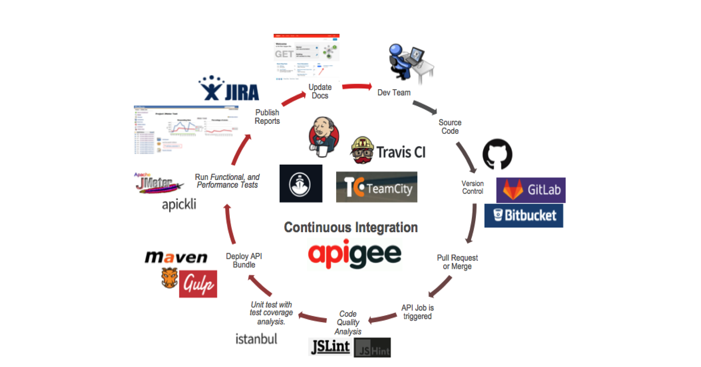
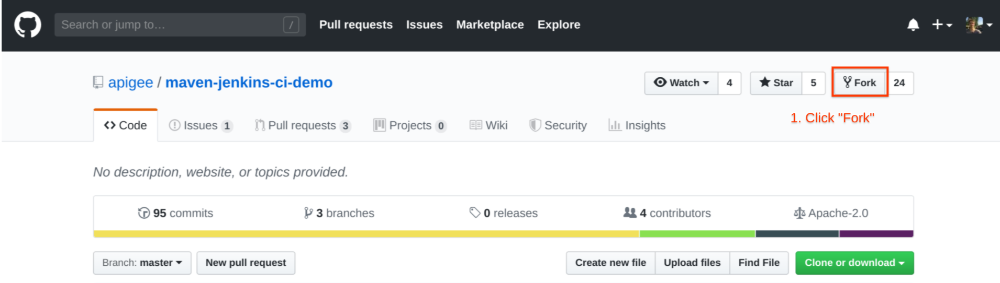
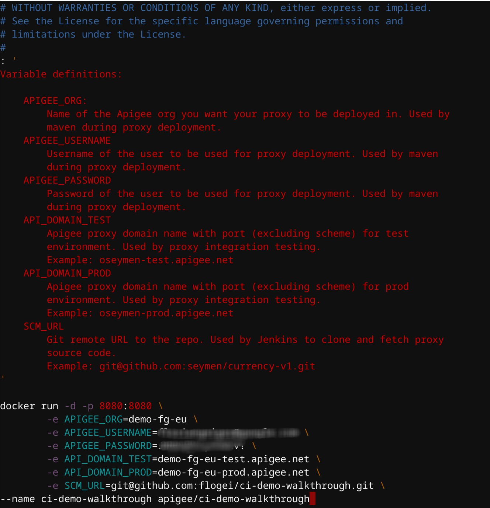
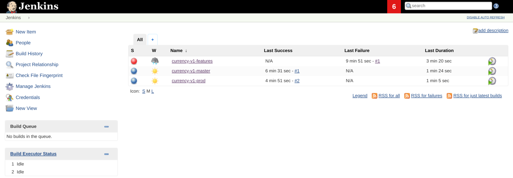
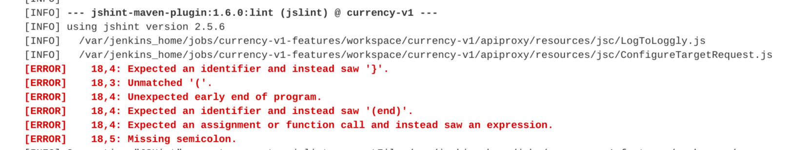
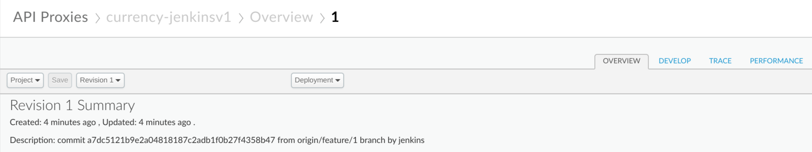
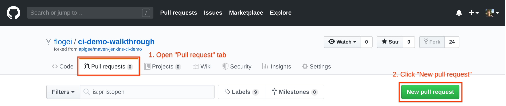
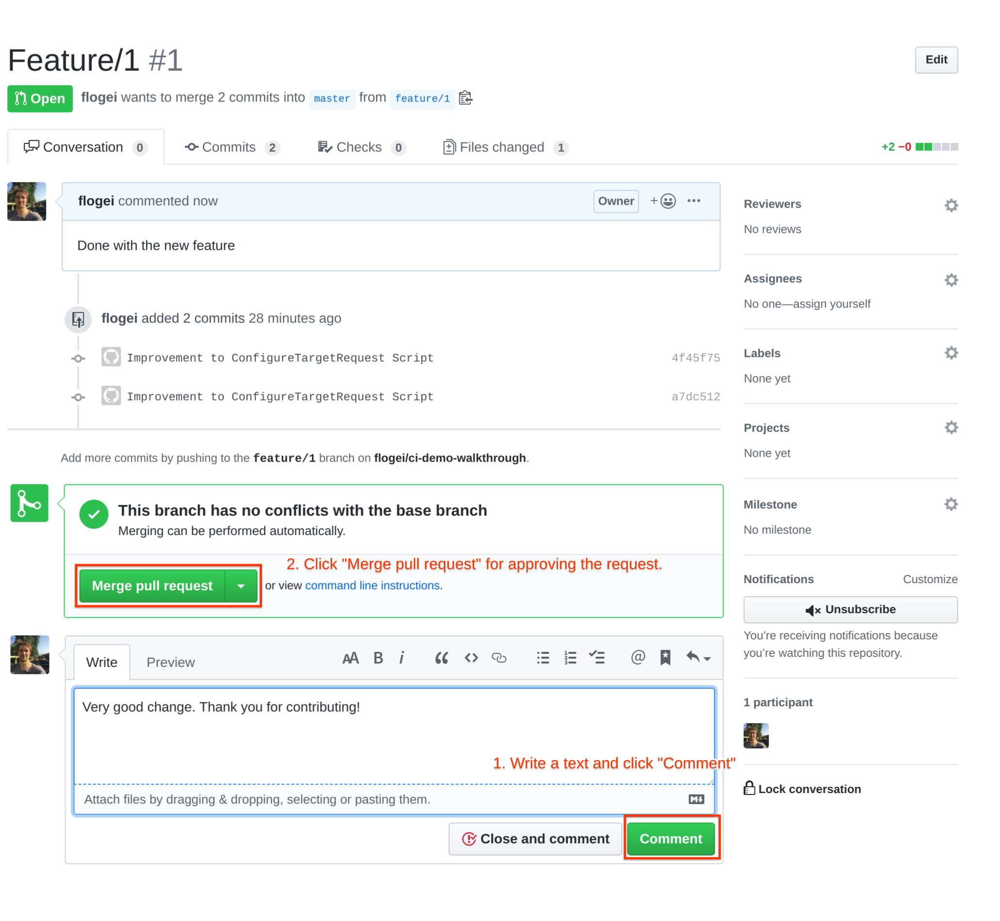
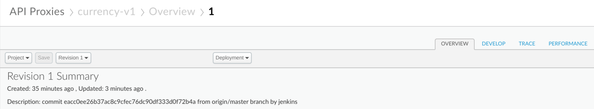
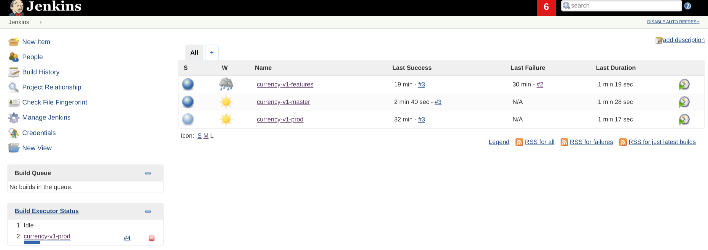

Summary: The objective of this project is to implement a containarised framework that can be used to demonstrate best practices around continuous integration for Apigee projects.
Id: maven-jenkins-ci-demo
Status: Draft
Environments: Apigee

# Continuous Integration for Apigee Proxies using Maven

[https://github.com/apigee/maven-jenkins-ci-demo](https://github.com/apigee/maven-jenkins-ci-demo)

## Introduction
### Demo Walkthrough of Continuous Integration for Apigee Proxies using Maven

**Last Updated:** 2019-09-04

Duration: 45 mins

Persona: API Developer



The objective of this project is to implement a containarised framework that can be used to demonstrate best practices around continuous integration for Apigee projects.

This is not an officially supported Google product.

### Components

#### Sample Apigee Proxy - Currency API

Project contains a sample proxy for a currency API that retrieves exchange rates for a base currency using [fixer.io](http://fixer.io/) API as the target.

See [Currency API OpenAPI Specification](https://github.com/flogei/ci-demo-walkthrough/blob/master/docs/currency-v1.yaml) for more information on northbound api design.

The following best practices demonstrated:

* Error handling - [Community Article](https://community.apigee.com/content/kbentry/23724/an-error-handling-pattern-for-apigee-proxies.html)
* Deployment suffix for team deployment - [Community Article](https://community.apigee.com/content/kbentry/26716/api-proxy-team-development-with-maven.html)
* Commit data in proxy description. See [pom](https://github.com/flogei/ci-demo-walkthrough/blob/master/currency-v1/pom.xml#L171).
* Unit testing - [Community Article](https://community.apigee.com/articles/3964/unit-testing-javascript-code-with-mocha-sinon-and.html).
* Integration testing with BDD and apickli - see [feature file](https://github.com/flogei/ci-demo-walkthrough/blob/master/currency-v1/test/integration/features/rates.feature).

See [maven phases](https://github.com/flogei/ci-demo-walkthrough/blob/master/docs/maven-phases.md) document to understand pom structure.

#### Dockerfile

Project contains a [Dockerfile](https://github.com/flogei/ci-demo-walkthrough/blob/master/docker/Dockerfile) that can be used to create a Jenkins image ready to start deploying currency api.

Docker implementation performs the following operations:

* Jenkins plugin installation - check out the [list of plugins installed](https://github.com/flogei/ci-demo-walkthrough/blob/master/docker/jenkins/plugins)
* Setup build jobs - see [jobs folder](https://github.com/flogei/ci-demo-walkthrough/blob/master/docker/jenkins/jobs)
* Configure maven settings
* Configure ssh for github authentication
* Install node.js and npm

Read the [Jenkins build pipeline](https://github.com/flogei/ci-demo-walkthrough/blob/master/docs/jenkins-pipeline.md) to understand how pipeline is configured for this demonstration.

## Setup the Environment

### Prerequisites

- Local machine with the following tools installed:
  - Docker
  - Maven
  - NodeJS
- Apigee Demo Organization
- Github Account
- Optional: VSCode with Github Extension

### Fork the Github Repository

In order to demonstrate CI, we will need to do commits/PRs to a repo and also need to transition code from one branch to another to trigger builds. We cannot use a shared repo during demos as we need to prevent jobs triggering on another jenkins instance pointing to the same repo. We also shouldn't clutter the commit history of this repo with test commits we will make during demos.

So fork this repo either to your own GitLab account or clone the repo locally and push it back to another git server, e.g. GitHub.

Go to [https://github.com/apigee/maven-jenkins-ci-demo](https://github.com/apigee/maven-jenkins-ci-demo)

Login with your Github Account

Fork the repository to your repository. This repo can be public or private.



Rename the repository to fit your topic


Change git server url for origin to point to the new repo in GitHub

```
git remote set-url origin <github-repo-ssh-url>
```

Clone the new repo to your machine

```
git clone <github-repo-ssh-url>
```


On your local machine go to the folder for the demo

```
Cd ci-demo-walkthrough
```

Push code to the new repo in GitHub

```
git push
Everything up-to-date
```

Use your local fork for below steps.

### Configure Branches

We only need the master and a prod branch for this demonstration - the idea is to have a branch per environment.

Delete all other branches apart from master branch in your forked repo

Setup a prod branch

```
git checkout -b prod
git push origin prod
git checkout master
```

### Create Jenkins image

Project includes a [Dockerfile](https://github.com/flogei/ci-demo-walkthrough/blob/master/docs/Dockerfile) that creates a Docker image using Jenkins official Docker image as base. It also sets up required Jenkins plugins and copies job configurations to the image.

```
docker build --no-cache -t apigee/ci-demo-walkthrough .
```

A new docker image called apigee/ci-demo-walkthrough will be created. This takes a while. Take a note of the output, which is the public ssh key we are using in the next step.


### Setup git ssh access

This project uses ssh public/private key pairs in order to authenticate the jenkins user to git server. [Why?](https://github.com/flogei/ci-demo-walkthrough/blob/master/docs/faq.md#why-ssh-for-git-authentication)

At the end of the image creation process, Dockerfile generates and prints out a new public key that you can setup to give jenkins push/pull access to your repo.

If you pushed the project files to your GitHub account, then go to your repo and within Settings click Deploy Keys on the left-hand menu. Next Add deploy key Give it a meaningful name under Title, copy/paste the contents of the public key as a new key and enable Allow write access option. And finally hit Add key


See [GitHub Deploy Keys Documentation](https://developer.github.com/guides/managing-deploy-keys/#deploy-keys)

### Run image
Positive
: Note: remove any previous currency-v1 deployments from the Apigee org in order to demonstrate proxies created successfully with correct revision numbers.

All parameters required to run Jenkins and Maven are supplied using environment variables. These variables are set directly to the docker container with the docker run command.

There is a script provided to make this process easier which can be found [here](https://github.com/flogei/ci-demo-walkthrough/blob/master/docs/setup/run-image.sh). Modify this script to provide values specific to your setup and execute the script to run the image.

Please note that setup/run-image.sh script is in source control. Copy this file to setup/.run-image.sh before making any changes to prevent sensitive data committed to this repo. Root .gitignore file contains a directive to ignore any changes to setup/.run-image.sh.

Go to the cloned folder

```
cp ./setup/run-image.sh ./setup/.run-image.sh
```

Modify the file and plug in your environment data:

```
vim ./setup/.run-image.sh
```


You get that data from your Apigee Account. You can look it up by going to your helloworld proxy.


Positive
: Note: Also change the port to 8080 if you are working on a Chromebook as the port 9001 cannot be used by docker containers.

You can also have to change the name to match the one of your docker images. Change apigee/ci to apigee/ci-demo-walkthrough and also replace my-ci with a unique name that does not match another container running on your machine.



A Description of the fields is within the file. After done with the modification run the script.

```
. ./setup/.run-image.sh
```

Script will output the docker container hash.

### Access Jenkins

Fire up a browser and hit http://localhost:8080 to access Jenkins UI.

Your setup is successful if you see Jenkins with this picture (notice the color of the circles). Give it a couple of minutes to start and the grey circle to turn blue (except the "currency-v1-features")



Please note that Jenkins will start all jobs upon start as it is configured to trigger each job every minute [why not git web hooks?](https://github.com/flogei/ci-demo-walkthrough/blob/master/docs/faq.md#why-not-git-web-hooks). Master and prod jobs should succeed but feature job will fail as we don't have a feature branch yet.

Please follow [usage](https://github.com/flogei/ci-demo-walkthrough/blob/master/docs/usage.md) to see Jenkins in action.

## CI/CD Demo Overview

This document assumes you have followed the [setup](https://github.com/flogei/ci-demo-walkthrough/blob/master/docs/setup.md) procedures and have a running Jenkins instance using Docker.

We are going to show a sample process of how CI/CD could look like.

1. Create a new branch for our new feature
2. A developer builds and tests locally
3. A developer commits changes to the feature branch
4. Jenkins builds the branch and pushes it to the respective Apigee Environment
5. We promote the feature branch to master
6. Jenkins pushes the branch to Apigee production environment

## Setup for our Feature development 

Right now we have 2 branches: master and prod


You can also check on the command line with

```
Git branch
* master
  prod
```

As a developer we now want to work on a new feature for our API proxy and therefore we create a new feature branch called *feature/1* from master branch

```
git checkout -b feature/1
```

## Local Testing

Let's simulate the steps a proxy developer would take to test their changes before they want a merge request or code review. Ideally the proxy developer can deploy multiple times until all tests pass and they are ready for merge request or code review. For this reason, we don't commit directly to the feature branch-- we don't want to clutter the Git log history, and we also don't want to rely on Jenkins just yet. Deploy and test your changes below, just as a proxy developer would from their local machine:

```
cd currency-v1
mvn install -Ptest -Denv.APIGEE_ORG={ORG} -Denv.APIGEE_USERNAME={username} -Denv.APIGEE_PASSWORD={password} -Denv.API_DOMAIN_TEST={apigee_proxy_domain}
```

Note that -Denv.API_DOMAIN_TEST is the same API_DOMAIN_TEST you've defined in your .run-image.sh file. If you don't want to pass that many arguments to maven, you can add those properties to your settings file *~/.m2/settings.xml*:

```
<profile>
    <id>test</id>
    <properties>
        <!-- these settings are for maven-jenkins-ci-demo -->
        <env.APIGEE_ORG>...</env.APIGEE_ORG>
        <env.APIGEE_USERNAME>...</env.APIGEE_USERNAME>
        <env.APIGEE_PASSWORD>...</env.APIGEE_PASSWORD>
        <env.API_DOMAIN_TEST>...</env.API_DOMAIN_TEST>
    </properties>
</profile>
```

If you decide to go with the settings file approach, you can just execute this command instead of the above long maven command:

```
mvn install -Ptest
```

Positive
: Note: If you have a Build failure with a NullPointerException you have most likely missed some variables

This command outputs the maven build process and is a good point to look through the different steps taken here:

* Linting (you will see jshint in the logs near the start)
* Unit Testing (unit testing is done with mocha)
* Bundle up the files to a zip file
* Upload it via the management API
* Run Integration Tests

This command will deploy the bundle to test environment as currency-<yourname>v1. Description of the proxy will be set to commit from a local branch by <your-name>.

Take a look at your Apigee Organization and see that there now is a proxy with the described name.


Now that we see all tests were successful, commit your changes to the feature branch.

## Commit changes to feature branch

Before committing our previous changes that we know were working, we do something that’s not recommended. And that's making a change we haven't tested locally, because we feel a little cheeky.

We will make a change to one of the JavaScripts files that will contain an error. Assuming you are still in the currency-v1 folder we make a change to ConfigureTargetRequest.js

```
vim apiproxy/resources/jsc/ConfigureTargetRequest.js
```

At the end of the file just insert a wrong JS statement (e.g. "if(}") and save the file.
```
// Trimmed the rest of the file...

* limitations under the License.
*/
context.setVariable('target.copy.pathsuffix', false);

if(}
```


Now we are not testing it locally with our own proxy version but rather commit the change to the feature branch more developers could be working with.

```
git commit -am "Improvement to ConfigureTargetRequest Script"
```

Push feature branch to remote.

```
git push origin feature/1
```

You will see at this point that Jenkins will automatically start currency-v1-features job which will deploy the bundle as currency-jenkinsv1 to test environment. 


Positive
: Note: If Jenkins does not automatically start the job after a while click the clock icon to the right to trigger the job.

After a short time you will see the job has failed and the **Last Failure** is set to a recent time. Click on the Job number **#2** (or any number after the hash sign) next to it to open the job details

In the menu click **Console Output**. Here you can see the error that has happened with the build. Obviously someone did not close an if-statement properly and the linting process found that error early on.



Now lets correct that error again and remove that mistake in our ConfigureTargetRequest.js file and maybe just add a comment to it.

```
vim apiproxy/resources/jsc/ConfigureTargetRequest.js
```

And again we commit our changes to the feature branch.

```
git commit -am "Improvement to ConfigureTargetRequest Script"
git push origin feature/1
```

Switch back to Jenkins to see the status of the build process and after some time we should see the features branch with a blue circle and a **Last Success** date.


In Apigee we now see the *currency-jenkinsv1* proxy deployed with the description of the proxy set to commit <commit_hash> from feature/1 branch by jenkins.



**Merge to master (using the UI)**

Now that the feature is complete, we create a pull request from feature branch to master.

Positive
: Note: Even though this is not a must-have but it is good to demonstrate a best-practice team development scenario where merge/pull requests are used for review/discussion of features before they are merged to master branch. If there are no conflicts, Github makes it particularly easy to merge from a pull request.

In github open the **Pull requests** tab and create a **new pull request**



Make sure to select the **master** as a base and your **feature/v1** branch as the branch to merge from. You can also see the commits we have done in that feature branch incl. our comments. Click **Create pull request** once you are done reviewing


Now you can put some comments about your pull request and also have the option to put in reviewers or other attributes to that pull request. Click **Create pull request** to finish your pull request.


Now that the pull request is created that's where it is a good practice to let some else approve your changes before we put the feature into the master branch. In that case we would switch hats to the lead developer and **Merge pull request** and click on **Confirm merge** after the review to put the changes into our master branch.



### Merge to master (alternative to UI pull request and merge)

If you'd like to manually do a merge, you can do so locally from shell:

```
git checkout master
git merge feature/1
git push
```

and the 2 last steps to cleanup the feature branch both locally and on your remote:

```
git branch -d feature/1
git push origin :feature/1
```


### Deploy master branch to test environment

You will see at this point that Jenkins will automatically start currency-v1-master job which will deploy the bundle as currency-v1 to test environment.

Description of the proxy will be set to commit <commit_hash> from master branch by jenkins.



### Automatically deploy master branch to prod environment (Continuous Delivery)

Continuous Delivery may or may not work for you and your company. Often other internal teams want to test at various stages of the API proxy SDLC. In those situations, automatic promotion on successful tests may not be the best option. But if CD works for you and your company, this is 1 way it could work.

Once currency-v1-master job is completed successfully, it will automatically merge master to prod branch which will trigger currency-v1-prod Jenkins job.



Production job will deploy the bundle as currency-v1 on prod environment and the description of the proxy will be set to commit <commit_hash> from master branch by jenkins.

Finally you can see that prod and dev have different revisions deployed that reflect our GitHub repository.


## Summary

In this demo we have showed how to use Jenkins alongside other Apigee Open source projects like Apickli, Apigee Maven plugin to build a CI/CD pipeline to deploy to Apigee.

### What we've covered

* Setup a new feature branch
* Commit changes to the branch
* Create a pull request for the feature branch
* Merge the feature branch into master after quality review
* Demonstrate continuous deployment by promoting the master branch to production